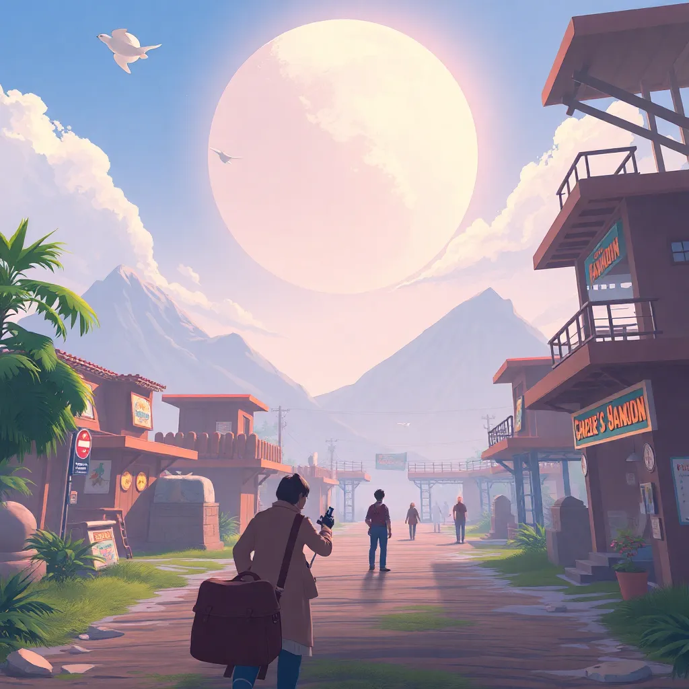
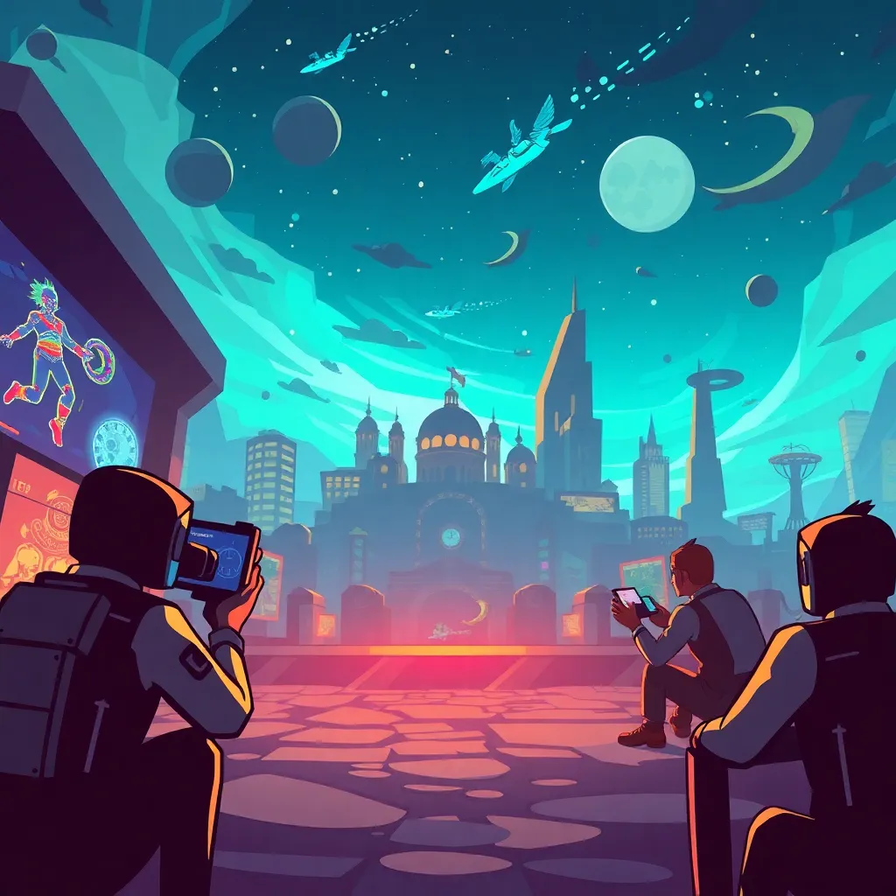
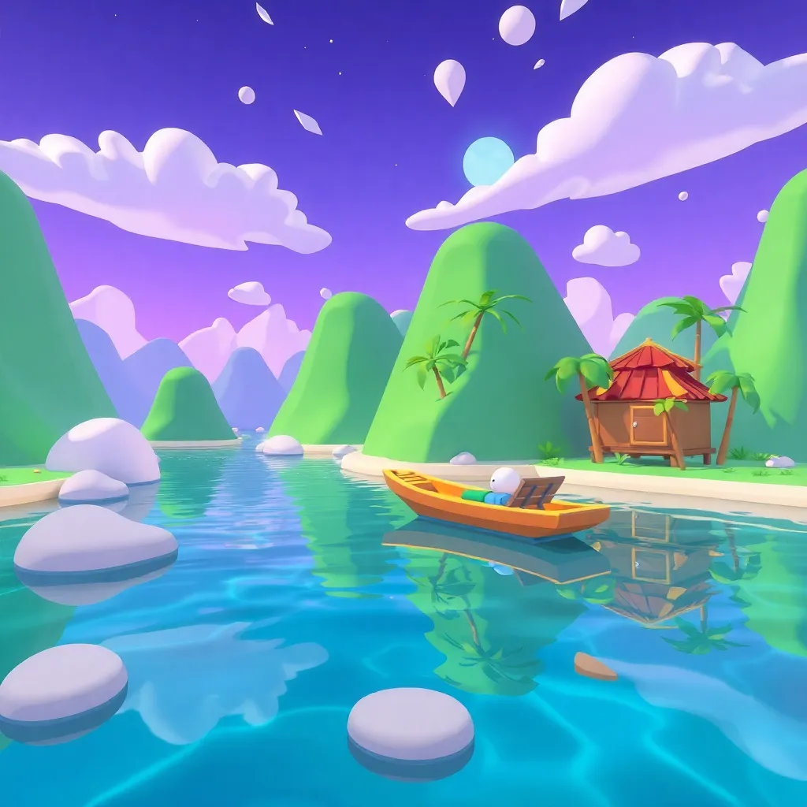

Title: Los productos de nuestra compañía
Date: 2023-10-01
Category: Productos, Compañía
Tags: contenido
Slug: product-description
Status: hidden

## Estos son los juegos que hemos desarrollado y de los que estamos muy orgullosos

### The Mistery of Moonlight Valley

- Este es un juego ambientado en un pueblo tranquilo, pero que esconde un gran misterio relacionado con la enorme Luna que se puede observar en sus cielos durante las 24 horas del día y a la que nadie parece prestar atención... Explora este apacible pueblo de las montañas rocosas y adentrate en las profundidades de unas antiguas ruinas de la civilización ya perdida que antes poblaba este lugar.

- Resuelve rompecabezas desafiantes pero a la vez relajantes, sin presión ninguna a la hora de resolverlos (nada de contrarrelojes, frases repetitivas o música de tensión).

- Elije tu propio camino: Con múltiples finales, el misterio de Moonlight Valley te dejará con la duda de que habría sucedido de no ser por aquella (fatídica, o no) decisión.

### Infinite Blue

- Adentrate en una aventura espacial sin precedentes en donde cada persona dispone de un equipo personal portatil capaz de controlar su nave espacial completamente personalizable. Si lo estabas pensando, sí esto es un juego multijugador masivo con un fuerte componente basado en la comunidad.

- Dos tipos de gameplay, dos escenarios: Cada jugador nada más empezar a jugar dispondrá de dos componentes imprescindibles, un personaje creado por él mismoo y una nave espacial personalizable controlada remotamente mediante el dispositivo portatil. Cada uno tendrá un aspecto esencial en la compleción de objetivos del juego, ya que el juego está diseñado para que no pueda existir el uno sin el otro.

- Fuerte componente de comunidad: A veces nuestro personaje y nuestra nave no bastarán para poder avanzar, por lo que resultará indispensable buscar ayuda. Algo tan fácil y tan dificil a la vez como lanzar una pregunta abierta a la comunidad.

### River Boat

- Nuestro primer juego. Fue un proyecto de final de curso en el cual decidimos llevar a cabo un videojuego sencillo y relajante. Este juego se basa en un sencillo personaje que dispone de un bote de pesca y decide aventurarse a viajar a lo largo del río que se encuentra cerca de su casa.

- Disfruta de un bello mundo que se construye proceduralmente a medida que avanzas por el río. Realiza actividades variadas y conoce todo lo que el mundo tiene que ofreces (podrías encontrar algún secreto).
