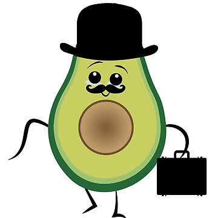

Title: Nuestro equipo está conformado únicamente por dos personas con mucha pasión por los videojuegos
Date: 1970-01-01
Category: Compañía, Equipo, Recursos Humanos
Slug: team
Status: hidden

## Señor Aguacate: Fundador de la empresa.

- El señor aguacate es un empresario de manual. Pero a su vez es un apasionado del mundillo de los videojuegos y un ávido jugador. Es el miembro del equipo super polivalente, siempre puede ayudar con un tema concreto a cualquiera que se lo pida.

- Sin embargo, se trata de alguien con unas ideas más tradicionales que por supuesto aportan estabilidad a la empresa, pero siempre hace falta algo más.

## Señorito manguito: Co-Fundador de la empresa

- El señorito manguito, el aprendiz de empresario que todo el mundo querría ser o tener. Es alguien aun más apasionado si cabe por los videojuegos, no tiene rival a la hora de crear ideas nuevas e imaginativas. El núcleo creativo de la empresa, no solo en el apartado artístico, sino también por sus inventos a la hora de codear que le ahorran años de vida al señor aguacate.

- Su juventud e inexperiencia lo convierten en alguien quizá demasiado impulsivo y ambicioso, lo que puede llevar a realizar sobreesfuerzos en el trabajo para añadir algún pequeño contenido extra a nuestros productos
